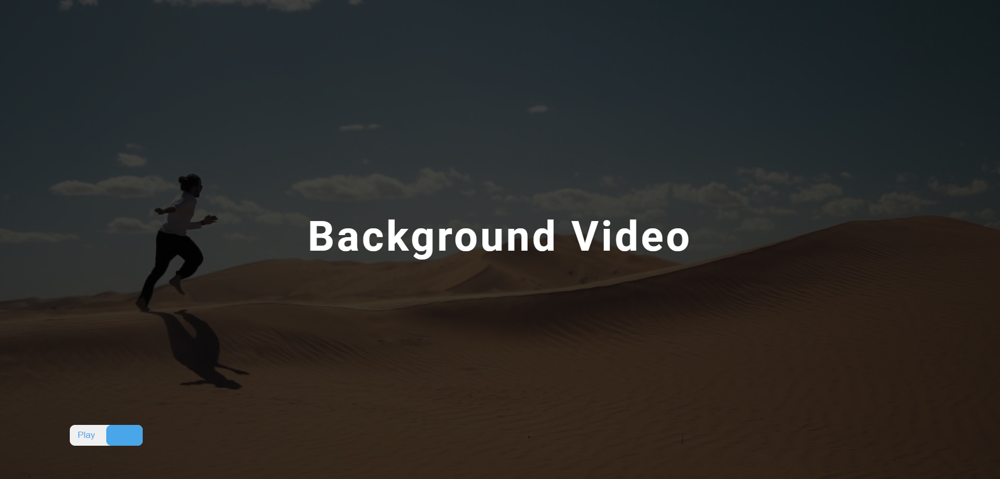

# Background Video
Hi, this repository contains a Background Video web app built with HTML, CSS, and JavaScript. It features a looping background video with a play/pause button for user control. A loading screen (loader) is also displayed before the webpage fully loads. The project demonstrates video control, DOM manipulation, and event handling using JavaScript.

Built with:

  

## Output:

